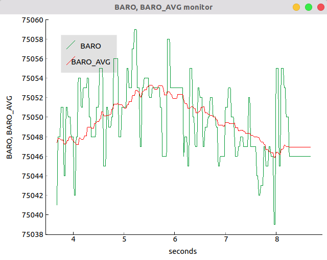

.. _plotting-data:

Plotting data
=============

There is an utility which plots any topic or set of topics, in real-time.
It is quite similar to (and inspired by) both `rqt_plot <https://wiki.ros.org/rqt_plot>`_ in ROS
and the `Arduino IDE serial plotter <https://learn.adafruit.com/experimenters-guide-for-metro/circ08-using%20the%20arduino%20serial%20plotter>`_
(by the way, did *you* know it?). It is contained in the file ``plotdata.py``. To use it:

0. Ensure that you have the ``pyqtgraph`` Python module installed.
1. Open the ``plotdata.py`` file. You should change the top lines.
   The variable TIME_SPAN sets the length of the plot (it rolls to the left, and TIME_SPAN sets
   how much time a specific data point will stay on the graph before disappearing).
   TOPICS is a list of topics that you want to graph. All topics should *only* contain a single number to be graphed
   (say, the temperature or the atmospheric pressure).
2. Save the ``plotdata.py`` file.
3. Run the master node and any other nodes, as usual.
4. When you wish to start plotting data, execute ``plotdata.py`` (``python plotdata.py`` or similar)
5. The script should show a window plotting the data in the specified topics.

See below for an image. Green is real-time barometer data. Red is the same data, processed by a 15-point rolling average.

